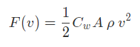
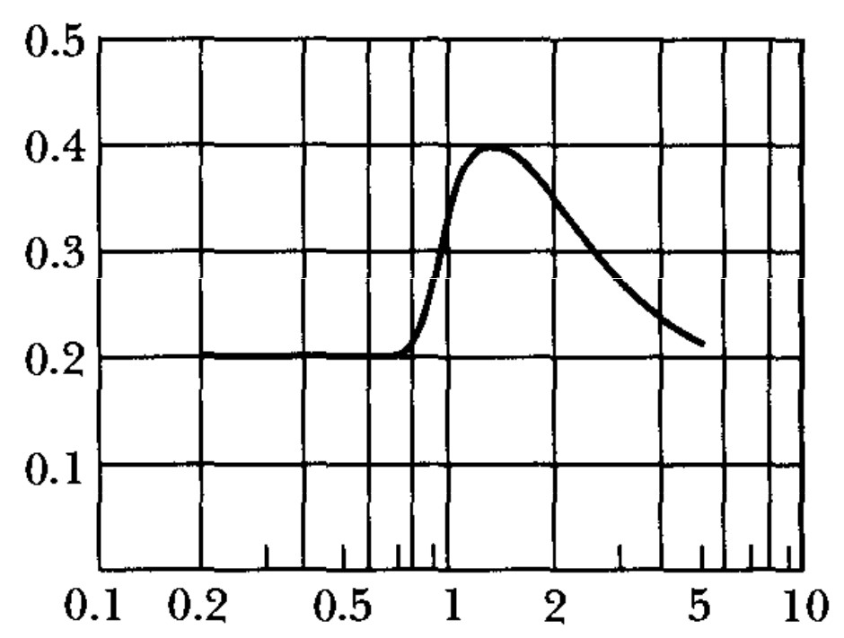

# Projectile-Motion
*This is a project of [AM-I fall 1399(2019)]*
## Table Of Content

  <ul>
    <li><a href="#objective">Objective</a></li>
    <li><a href="#about-drag-coefficient">About Drag Coefficient</a></li>
    <li><a href="#how-to-use-">How to Use</a></li>
  </ul>

-----------------------------------
### Objective
The objective of this project is to simulate the motion of a projectile with air resistance which follows below equation

that *A* is the efficient surface of object, *p* is the air density, *v* is the velocity of object and *C_w* is a coefficient that is called drag coefficient.

-----------------------------------
### About Drag Coefficient
This coefficient has relation to Mach number which is the ratio of object velocity to air velocity and a typical graph of this relation has shown in figure 1.

  <figure>
    
    <figcaption>Fig.1 - drag-coefficient by mach number</figcaption>
  </figure>

I used [this digitizer](http://getdata-graph-digitizer.com/index.php) to get data from this figure (really really thanks them for their app 🙏)

-------------------------------------

### How to use? 🤨
As easy as possible :)

1. Clone project 😀
2. IF you don't have matplotlib installed, install it with this [guide](https://matplotlib.org/users/installing.html)
3. Run command-line module with your python interpreter (python 3.8.x is preferred)
4. Enter parameter (be carefull for units)
5. Watch graphs of motion and enjoy 😃

*Notice : you can find graph's file in *output* directory*

*P.S. : when a newbie code pyhton, don't care about project structure 😄*
